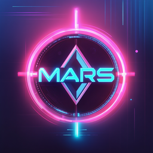

# Marina3D

A beautiful desktop 3D image generator using Stability AI, built with Electron.



## Features

- **Text to Image**: Generate images from text prompts
- **Image to Image**: Transform existing images with AI
- **Text and Image Reference**: Combine text prompts with reference images
- **Poster Mode**: Create professional posters with various styles
- **Advanced Controls**: Fine-tune generation with CFG scale, steps, samples, and seed
- **Batch Processing**: Generate multiple images at once
- **Cross-Platform**: Available for both macOS and Windows

## Building Marina3D

### Prerequisites

- Node.js (v16 or higher)
- npm

### Installation

1. Clone or download this repository
2. Install dependencies:
   ```bash
   npm install
   ```

### Development

To run Marina3D in development mode:
```bash
npm start
```

### Building Executables

Marina3D can be built for multiple platforms:

#### Build for macOS only:
```bash
npm run build:mac
```
Creates:
- `Marina3D-1.0.0-mac.dmg` - macOS installer (Universal)
- `Marina3D-1.0.0-mac-x64.zip` - macOS app (Intel)
- `Marina3D-1.0.0-mac-arm64.zip` - macOS app (Apple Silicon)

#### Build for Windows only:
```bash
npm run build:win
```
Creates:
- `Marina3D-1.0.0-win.exe` - Windows installer (Universal)
- `Marina3D-1.0.0-win-x64.exe` - Windows installer (64-bit)
- `Marina3D-1.0.0-win-ia32.exe` - Windows installer (32-bit)

#### Build for all platforms:
```bash
npm run build:all
# or
npm run dist
```

### Build Output

All executables are created in the `dist/` directory:

**macOS:**
- **Marina3D-1.0.0-mac.dmg** - Drag-and-drop installer for macOS
- **Marina3D-1.0.0-mac-x64.zip** - Portable app for Intel Macs
- **Marina3D-1.0.0-mac-arm64.zip** - Portable app for Apple Silicon Macs

**Windows:**
- **Marina3D-1.0.0-win.exe** - Full installer (supports both 32-bit and 64-bit)
- **Marina3D-1.0.0-win-x64.exe** - 64-bit installer
- **Marina3D-1.0.0-win-ia32.exe** - 32-bit installer

## Installation

### macOS
1. Download `Marina3D-1.0.0-mac.dmg`
2. Open the DMG file
3. Drag Marina3D to your Applications folder
4. Launch Marina3D from Applications

### Windows
1. Download the appropriate `.exe` file for your system
2. Run the installer
3. Follow the installation wizard
4. Launch Marina3D from the Start Menu or Desktop shortcut

## Usage

1. **Set up your API**: Configure your Stability AI API key in the application
2. **Choose Mode**: Select between General Image Generation or Poster Mode
3. **Input**: Provide text prompts and/or reference images
4. **Configure**: Adjust advanced settings if needed
5. **Generate**: Click Generate to create your images
6. **Save**: Images are automatically saved to your selected folder

## Technical Details

- **Framework**: Electron
- **AI Provider**: Stability AI
- **Supported Formats**: PNG, JPG, JPEG
- **Platform Support**: macOS (Intel & Apple Silicon), Windows (32-bit & 64-bit)

## Icon

The Marina3D icon was created from a custom AI-generated image and optimized for both macOS (.icns) and Windows (.ico) formats with multiple resolutions for crisp display at any size.

## License

ISC License

---

**Marina3D Team** 